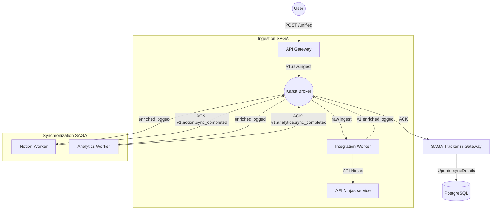

# LifeHub Architecture: Unified SAGA

## Overview

LifeHub implements a **Choreography-based SAGA pattern** using Kafka as the decentralized backbone. This architecture decouples state management into two distinct domains: **Enrichment** (AI/API Ninjas) and **Integration** (External Syncs).

## Architecture Diagram (Distributed Choreography)



---

## 🔄 SAGA State Machine

LifeHub uses a decoupled state management approach where the source of truth is always updated asynchronously via feedback events.

### 1. Enrichment States (`enrichmentStatus`)
- **`NOT_REQUIRED`**: Default for structured data that doesn't need AI processing.
- **`PENDING`**: Initial state for NLP records. Gateway has saved the text but enrichment hasn't started.
- **`COMPLETED`**: Integration worker successfully enriched the data via API Ninjas.
- **`FAILED`**: Enrichment failed after maximum retries.

### 2. Sync States (`syncDetails` JSON)
Instead of a single sync status, we use a flexible JSON object to track multiple downstream consumers:
```json
{
  "notion": "DONE",
  "analytics": "FAILED",
  "strava": "PENDING"
}
```
The **SAGA Tracker** updates specific keys in this object as `v1.{service}.sync_completed` or `v1.{service}.sync_failed` events arrive.

---

## 🛡️ Failure & Compensation Handling

### Retry Policy
LifeHub workers implement **Exponential Backoff** for external API calls (API Ninjas, Notion).
- **Default**: 3 retries with base delay of 1s.
- **Dead Letter Queue (DLQ)**: Events that fail after 3 retries are moved to a `.error` topic for manual inspection.

### "Exactly-Once" Semantics
We achieve high consistency across distributed components via:
1. **At-Least-Once Kafka Delivery**: Standard producer configuration.
2. **Global Idempotency Lock**: Workers check Redis `idempotency:{msgId}` before execution. If the lock exists, the message is ignored as a duplicate.

---

## 📋 Infrastructure Specifications

### Kafka Topic Convention
- **Ingestion**: `v1.domain.raw.ingest` (e.g., `v1.nutrition.raw.ingest`)
- **Enrichment**: `v1.domain.enriched.logged`
- **Feedback**: `v1.service.sync_completed` / `v1.service.sync_failed`

### Redis Keyspace
- `idempotency:{service}:{msgId}`: TTL 24h.
- `stats:{date}:{metric}`: Used by Analytics worker for real-time aggregation.

### Scaling Strategy
- **Gateway**: Horizontally scalable behind a Load Balancer.
- **Workers**: Scale specific workers (e.g., `IntegrationWorker`) by increasing Kafka consumer partitions.

---

## ⚠️ Deferred Modules (Not Yet Integrated)

> [!NOTE]
> The following modules exist in the codebase but are **not yet wired into the SAGA workflow**. They are excluded from the current architecture diagram and should not be treated as active consumers/producers on the Kafka bus.

| Module | Status | Reason |
|--------|--------|--------|
| `mood` | 🚧 Stub only | No enrichment logic or Kafka topic defined. Schema exists but no event flow. |
| `learning` | 🚧 Stub only | Controller scaffolded (`learning.controller.ts`) but not connected to any SAGA step. |
| `reading` | 🚧 Stub only | No controller, service, or event topic wired up yet. |

**Until these modules are promoted:**
- Do **not** add them to Kafka topic conventions.
- Do **not** include them in integration worker routing.
- Do **not** reference them in `syncDetails` JSON keys.

When ready to promote a module, follow the [Scalability](#scalability) pattern: subscribe to `v1.*.enriched.logged` and publish `v1.{module}.sync_completed`.

---

## Scalability
- **Horizontal**: Workers can be scaled independently based on load.
- **Decoupled**: Adding a new downstream service (e.g., a "Health Connect" sync) only requires subscribing to `v1.*.enriched.logged`.

Built with passion | [Diagrams](./DIAGRAM.md) | [Roadmap](./ROADMAP.md)
