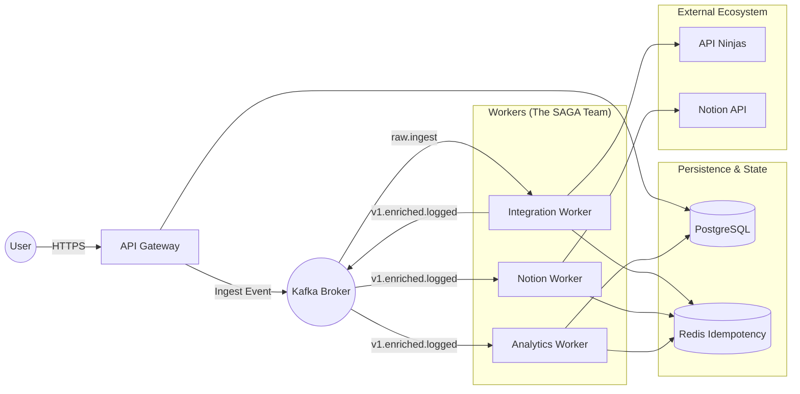
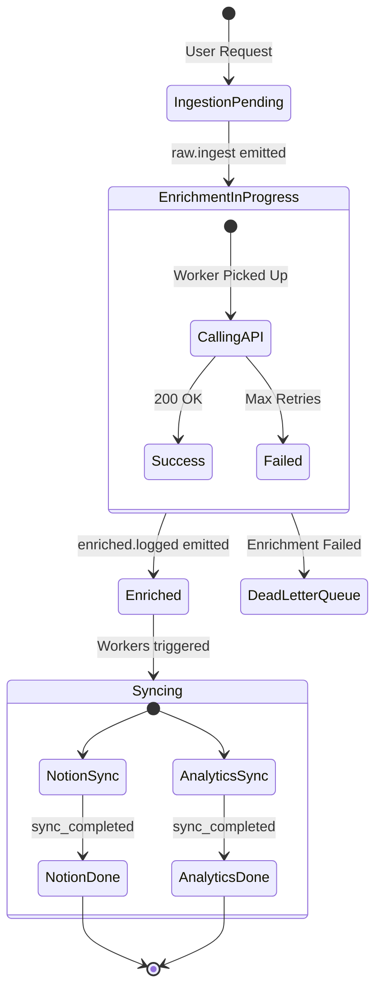
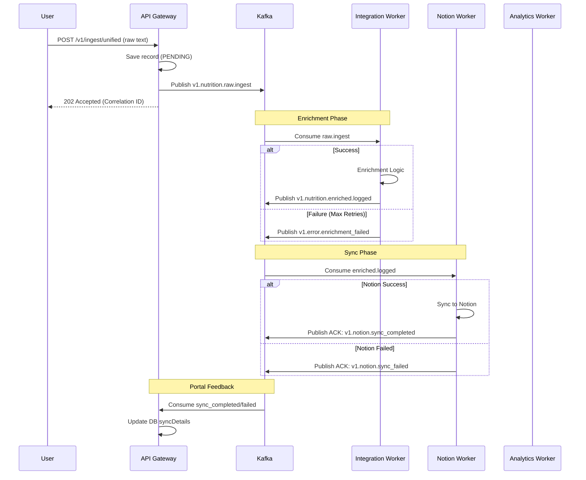
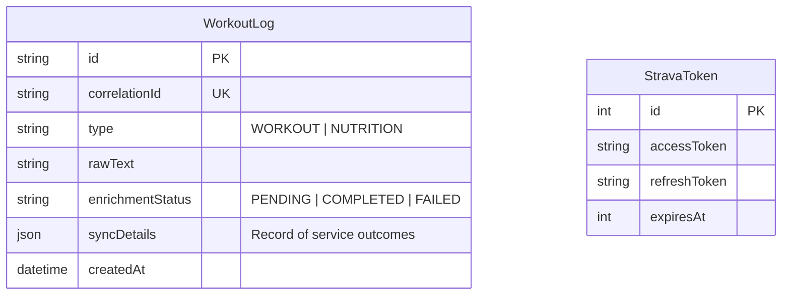
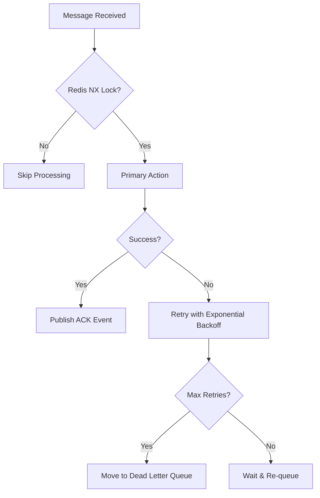

# LifeHub Architecture Diagrams

This document provides visual representations of the LifeHub ecosystem using **Mermaid.js**. These diagrams reflect the **Choreography SAGA** pattern and the distributed worker model.

---

## 1. System Overview (Landscape)

---

## 2. Record Lifecycle (State Transition)

This diagram tracks how a tracking record moves through the system's decoupled states.

---

## 3. SAGA Choreography Flow (Sequence)

Including the **Error Paths** and **Feedback Loop**.

---

## 4. Entity Relationship Diagram (ERD)

---

## 5. Resilience & Idempotency Logic

---

> [!TIP]
> All diagrams are maintained in **Mermaid.js**. You can preview them directly in GitHub or use the [Mermaid Live Editor](https://mermaid.live/).
