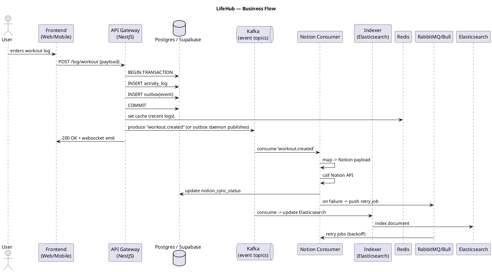
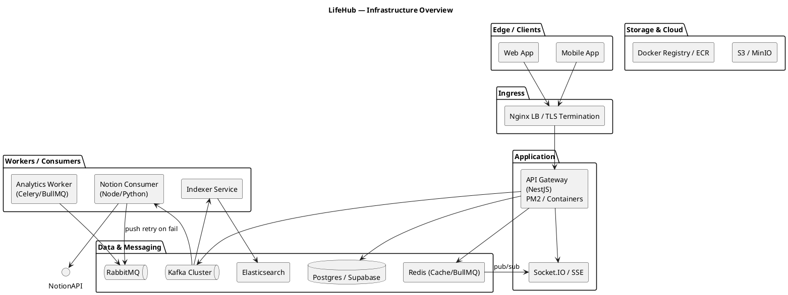
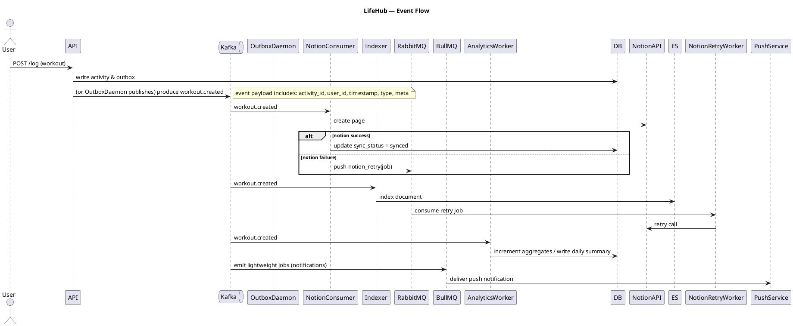

# LifeHub — Diagrams (PlantUML) + SQL Schema

This document contains **PlantUML** diagrams (business flow, infrastructure, event flow) and **Postgres (psql) DDL/code snippets** so you can visualize the diagram using PlantUML and try out the schema locally.

---

## 1) Business Flow (PlantUML)

Save the following to the file `diagrams/business-flow.puml` and render it using PlantUML.



---

## 2) Infrastructure Architecture (PlantUML)

Save the following file `diagrams/infrastructure.puml`.



---

## 3) Event Flow Diagram (PlantUML)

Save the following file `diagrams/event-flow.puml`.



---

## 4) Postgres (psql) Schema & snippets

Save to `db/schema.sql` and run `psql -f db/schema.sql` (or use Supabase SQL editor).

```sql
-- Users
CREATE TABLE IF NOT EXISTS users (
  id uuid PRIMARY KEY DEFAULT gen_random_uuid(),
  email text UNIQUE NOT NULL,
  display_name text,
  created_at timestamptz DEFAULT now()
);

-- Activity logs
CREATE TABLE IF NOT EXISTS activity_logs (
  id uuid PRIMARY KEY DEFAULT gen_random_uuid(),
  user_id uuid REFERENCES users(id) ON DELETE CASCADE,
  type text NOT NULL,
  payload jsonb,
  volume numeric,
  created_at timestamptz DEFAULT now(),
  sync_status text DEFAULT 'pending'
);

-- Outbox pattern table
CREATE TABLE IF NOT EXISTS outbox (
  id bigserial PRIMARY KEY,
  aggregate_type text NOT NULL,
  aggregate_id uuid,
  topic text NOT NULL,
  payload jsonb NOT NULL,
  published boolean DEFAULT false,
  created_at timestamptz DEFAULT now()
);

-- Notion syncs
CREATE TABLE IF NOT EXISTS notion_syncs (
  id bigserial PRIMARY KEY,
  activity_id uuid REFERENCES activity_logs(id) ON DELETE CASCADE,
  notion_page_id text,
  status text,
  last_error text,
  updated_at timestamptz DEFAULT now()
);

-- Analytics materialized view example
CREATE MATERIALIZED VIEW IF NOT EXISTS daily_user_volume AS
SELECT
  user_id,
  date_trunc('day', created_at) AS day,
  sum((payload->>'volume')::numeric) AS total_volume
FROM activity_logs
GROUP BY user_id, date_trunc('day', created_at);

-- Indexes for search/performance
CREATE INDEX IF NOT EXISTS idx_activity_user_created ON activity_logs(user_id, created_at DESC);
CREATE INDEX IF NOT EXISTS idx_activity_type ON activity_logs(type);
CREATE INDEX IF NOT EXISTS idx_outbox_published ON outbox(published);

-- Example transaction: write activity + outbox
BEGIN;
  INSERT INTO activity_logs(user_id, type, payload) VALUES
  ('00000000-0000-0000-0000-000000000001','deadlift', '{"sets":4,"reps":6,"weight":120}'::jsonb)
  RETURNING id;
  -- suppose returned id = <activity_id>
  INSERT INTO outbox(aggregate_type, aggregate_id, topic, payload) VALUES
  ('activity', '<activity_id>'::uuid, 'workout.created', json_build_object('activity_id', '<activity_id>'));
COMMIT;

-- Outbox daemon pseudo-query to publish
SELECT id, topic, payload FROM outbox WHERE published = false ORDER BY created_at LIMIT 100;
-- after publish -> UPDATE outbox SET published = true WHERE id IN (...)
```

---
