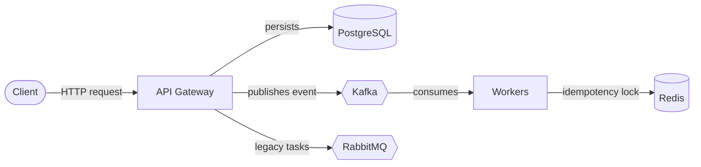

# LifeHub - Unified Choreography SAGA Architecture

LifeHub is a high-performance life-logging system that simplifies the tracking of habits, nutrition, and activities. It uses a **Choreography-based SAGA pattern** to coordinate between services, ensuring data consistency and async enrichment across distributed components.

- **PostgreSQL + Prisma**: Persistent storage and source of truth.
- **Kafka**: Decentralized event streaming for SAGA choreography.
- **RabbitMQ**: Reliable task processing for legacy integrations.
- **Redis**: Global idempotency storage and caching.
- **API Ninjas**: Asynchronous data enrichment (Nutrition, Calories).

---

## Architecture



- The **API Gateway** (NestJS) handles client requests and is the source of truth, writing records to **PostgreSQL** before anything else happens.
- For the async SAGA flow, the Gateway publishes events to **Kafka**; the **Workers** service consumes them to enrich data and sync to external systems (Notion, analytics).
- **Redis** provides a global idempotency lock so each event is only processed once, even under retries.
- **RabbitMQ** carries legacy, non-SAGA integration tasks (e.g. Strava) outside the Kafka event flow.

---

## 📁 Project Structure

```
lifehub/
├── services/
│   ├── api-gateway/       # NestJS Gateway & SAGA Tracker
│   ├── workers/           # Unified Worker Suite
│   │   ├── integration/   # API Ninjas Enrichment (Enricher)
│   │   ├── notion/        # Notion Integration (Consumer)
│   │   └── analytics/     # Redis Aggregator (Consumer)
│   └── frontend/          # Web Interface
├── docker-compose.yml     # Infrastructure (Postgres, Kafka, RabbitMQ, Redis)
└── pnpm-workspace.yaml    # Monorepo configuration
```

---

## 🚀 Quick Start

### Prerequisites
- Docker & Docker Compose
- Node.js (>=20)
- **pnpm** (Recommended)

### 1. Start Infrastructure
```bash
docker-compose up -d
```
*Wait for Kafka, Redis, and Postgres to initialize (approx. 30s).*

### 2. Install Dependencies
```bash
pnpm install
```

### 3. Configure Environment
Create `.env` files based on the `.env.example` in `services/api-gateway` and `services/workers`.

| Service | File | Key Variables |
| :--- | :--- | :--- |
| **API Gateway** | `services/api-gateway/.env` | `DATABASE_URL`, `KAFKA_BROKER`, `REDIS_HOST`, `STRAVA_CLIENT_ID` |
| **Workers** | `services/workers/.env` | `WORKER_TYPE`, `NINJA_API_KEY`, `NOTION_TOKEN`, `NOTION_DB_ID` |

> [!TIP]
> Use `localhost:29092` for Kafka when running services outside Docker. Use `kafka:9092` when containerizing.

### 4. Database Setup
```bash
cd services/api-gateway
pnpm run prisma:generate
pnpm run prisma:migrate:dev
```

---

## ⚙️ Configuration Deep Dive

### Environment Variables Matrix

| Variable | Description | Security Level | Purpose |
| :--- | :--- | :---: | :--- |
| `KAFKA_BROKER` | Address of the Kafka cluster. | Low | SAGA Backbone |
| `DATABASE_URL` | PostgreSQL connection string. | **Critical** | Persistence |
| `REDIS_HOST` | Redis instance for idempotency. | Medium | Resilience |
| `NINJA_API_KEY` | API Ninjas key for NL enrichment. | **High** | AI Data |
| `NOTION_TOKEN` | Integration token for Notion. | **High** | External Sync |
| `NOTION_DB_ID` | Target Notion Database ID. | Medium | External Sync |

### Production Hardening
For production deployments, ensure:
- **Kafka Auth**: Enable SASL/SCRAM or SSL for broker communication.
- **Secrets Management**: Use Vault or AWS Secrets Manager instead of raw `.env` files.
- **Database Pooling**: Use Prisma Accelerate or `pgbouncer` to handle high connection spikes.

---

## 🔥 Key Features (Technical)

### 🛠️ Unified Ingestion SAGA
LifeHub supports both **Natural Language (NLP)** and **Structured Data** through a single entry point. 
- **NL Flow**: Ingest -> Integration Worker (API Ninjas) -> Enrichment -> Notion/Analytics Sync.
- **Structured Flow**: Direct record creation and broadcast to consumers.
- **Atomic Operations**: Gateway ensures a DB record exists *before* emitting the Kafka event.

### 🛡️ Distributed Idempotency
Every SAGA participant (Worker/Consumer) checks a global Redis lock (`idempotency:service:msgId`) before processing.
- **Strategy**: `SET NX` with 24h TTL.
- **Resilience**: Ensures "Exactly-Once" side effects even during Kafka rebalances or network retries.

### 📊 Real-time Enrichment
Using API Ninjas, LifeHub automatically calculates macro-nutrients and calories burned from simple text logs.
- **Async Processing**: Enrichment happens off the main request-response cycle.
- **Status Tracking**: The record's `enrichmentStatus` is updated via a feedback loop.

---

## 🏗️ Local Development & Debugging

### Monitoring Kafka
To monitor the event flow in real-time, use the built-in Kafka console consumer:
```bash
docker exec -it kafka /opt/bitnami/kafka/bin/kafka-console-consumer.sh \
  --bootstrap-server localhost:9092 \
  --topic v1.nutrition.raw.ingest --from-beginning
```

### Debugging Workers
You can run workers individually by setting the `WORKER_TYPE` environment variable:
```bash
# Run only the Notion sync worker
WORKER_TYPE=notion pnpm run dev:worker
```

### Common Issues
- **Kafka Connection Refused**: Ensure `KAFKA_BROKER` matches the access method (localhost vs docker).
- **Prisma Schema Mismatch**: Run `pnpm prisma:generate` after any schema changes.

---

## 🔌 API Examples

### Unified Ingest (NLP)
```bash
curl -X POST http://localhost:8080/api/ingest/unified \
  -H "Content-Type: application/json" \
  -d '{
    "text": "Ate 2 large scrambled eggs and 1 slice of whole wheat toast"
  }'
```

### Unified Ingest (Structured)
```bash
curl -X POST http://localhost:8080/api/ingest/unified \
  -H "Content-Type: application/json" \
  -d '{
    "structured": [
      {
        "type": "nutrition",
        "data": {
          "description": "Post-workout Shake",
          "calories": 350,
          "protein": 40,
          "carbs": 20,
          "fat": 5
        }
      }
    ]
  }'
```

---

## 🛠️ Development Commands

| Task | Command |
| :--- | :--- |
| Start All | `pnpm run dev` |
| DB Studio | `pnpm --filter api-gateway run prisma:studio` |
| Lint | `pnpm run lint` |
| Test | `pnpm run test` |

---

## 🧠 SAGA Feedback Loop
LifeHub implements a **Feedback Loop** where consumers emit ACK events (`sync_completed`/`sync_failed`). The API Gateway's **SAGA Tracker** listens to these events to update the logical `syncStatus` in real-time.

Built with passion | [Architecture Docs](./ARCHITECTURE.md) | [Diagrams](./DIAGRAM.md) | [Roadmap](./ROADMAP.md)

